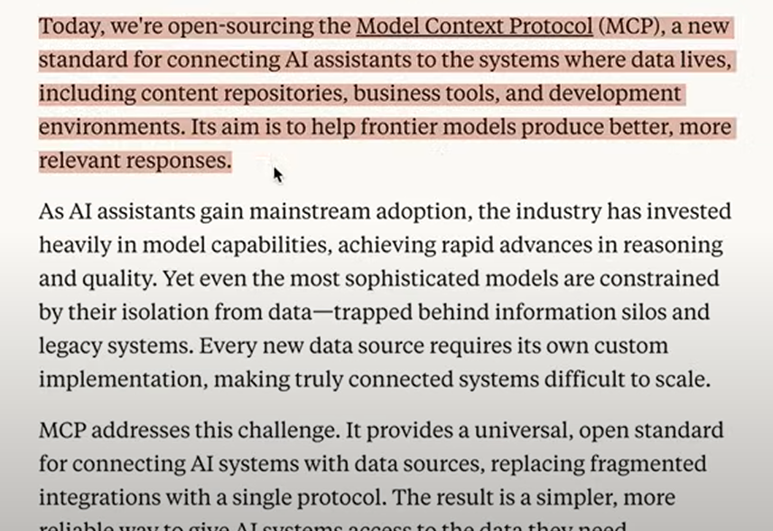

## We will see: 
MCP is a protocol for exposing tools and data in a unified, machine-readable way, so that LLMs can access and interact with them easily
How to set up an MCP server using Python to build AI systems around it.  MCP is just REST for LLMs! MCP - you can able to expose your server 24x7. Can include as many connections a possible to make it a toolset. Can use single source of truth to all your connections 
Then interact MCP with agent to get the job done

The only diff I found is MCP can be able to maintains all your connections, resources, requests in a single toolbox etcc..

---

## Introduction

Connecting AI systems to the systems where data lives.  

The current approach typically involves writing custom functions and using tools to connect to an LLM.  
**MCP doesn’t introduce new capabilities** we couldn’t achieve before — rather, it introduces a **unified way** of doing it.

We now have a **protocol** that standardizes how APIs are exposed to LLMs.  
Instead of every developer creating their own custom integrations (e.g., to Slack, Google Drive), MCP provides a **standard protocol** that defines:

- Schema  
- Function signatures  
- Documentation  
- Arguments

With this standardized MCP layer, AI applications can integrate tools more easily and reliably.  
MCP is lightweight — no need to reinvent integration logic every time we connect an LLM to a new tool.

🔗 **MCP servers repository**: [https://github.com/modelcontextprotocol/servers](https://github.com/modelcontextprotocol/servers)

There are various types of MCP servers available that expose tools and APIs.  
This makes it easier for developers to start integrating AI systems and building agents.

Today, we typically build applications around LLMs using function calling or writing custom logic.  
MCP streamlines this and encourages reusability across tools and platforms.

---

## Technical Aspect

**Key Concepts:**

- **MCP Hosts**: Programs like Claude Desktop, IDEs, or Python apps that want to access data via MCP.  
- **MCP Clients**: Protocol clients that maintain 1:1 connections with MCP servers.  
- **MCP Servers**: Lightweight services that expose specific capabilities (tools, resources, prompts) through the MCP protocol.  
- **Local Data Sources**: Files, databases, and services on your machine, accessible through the MCP server.  
- **Remote Services**: APIs or cloud platforms MCP servers can connect to.

---

The **host** (e.g., a Python application) connects to a **server** through an **MCP client** using the MCP protocol.  
This setup enables communication, data exchange, and tool invocation.

Each MCP server has a specific purpose and contains application-specific logic. This could include:

- Simple string manipulation  
- File system interaction  
- Database queries  
- API calls  
- Any custom logic

This logic becomes accessible to host applications via MCP, enabling seamless integration into AI workflows.

---

## Developer Perspective

There’s a distinction between:

- **Using MCP as a local tool** (e.g., your personal assistant app)  
- **Developing MCP tools** by writing custom servers and client applications

If you're a **developer working with MCP**, you need to understand:

1. **How to set up a server**  
   - You can build your own custom tools (functions, APIs), or use community-provided servers:  
     [https://github.com/modelcontextprotocol/servers](https://github.com/modelcontextprotocol/servers)

2. **How to set up a host application**  
   - Your host (like a Python backend) connects to a server through an MCP client.

3. **How to connect local data or remote services to an MCP server**  
   - Using Python, you can expose local files, APIs, databases, or other services.

---

## Transport Mechanisms Deep Dive

There are two main transport mechanisms available in MCP:

### 1. **Standard IO (stdio)**

- Everything lives on the local machine — ideal for local development
- Communication happens via standard input/output (stdin/stdout)
- You run both the server and client on the same machine (e.g., via a Python script)
- No networking or external infrastructure required

💡 Best for **prototyping**, **testing**, and **personal workflows**

---

### 2. **Server-Sent Events (SSE)**

- Your MCP server runs remotely (e.g., in the cloud or on another machine)
- Communication happens over HTTP using **Server-Sent Events**
- The server is accessible via API, and clients can connect from different locations

### Do stdio and SSE have the same definition?
No, they do not have the same definition — but they both serve the same purpose:
They are transport mechanisms used by the MCP client to communicate with an MCP server.

✅ Same Purpose
Both stdio and SSE are used to:

Send/receive messages between the MCP client and server

Allow the AI host (e.g., Claude, Python app) to call tools or access data on the MCP server

| Feature                 | **Standard IO (stdio)**                              | **Server-Sent Events (SSE)**                            |
| ----------------------- | ---------------------------------------------------- | ------------------------------------------------------- |
| **How it communicates** | Uses standard input/output streams between processes | Uses HTTP connection with a persistent stream of events |
| **Where it runs**       | Typically **on the same machine** (local dev)        | Can run **across machines or networks** (remote dev)    |
| **Server starts**       | As a subprocess of the client                        | As an independent web server accessible via HTTP        |
| **Ease of setup**       | Very easy — just point to a local script             | Slightly more complex — needs network setup and ports   |
| **Good for**            | Quick prototyping, local tools, one-off agents       | Scalable apps, remote tools, shared APIs                |

This setup enables:

- Centralizing tools and APIs in one persistent server  
- Connecting multiple clients to a shared toolset  
- Reusing resources and capabilities across projects  
- Spinning up different servers for different domains or applications

💡 Best for **remote development**, **team collaboration**, or **production-scale deployment**

---

### What We'll Build

We’ll implement an **SSE-based architecture**:

- Set up an MCP server using **Docker**
- Expose tools and resources via that server
- Connect a Python application (client) to interact with it

Stay tuned for the hands-on implementation.

MCP defines three core primitives that servers can implement:
1. Tools: Model-controlled functions that LLMs can invoke (like API calls, computations)
2. Resources: Application-controlled data that provides context (like file contents, database records)
3. Prompts: User-controlled templates for LLM interactions
For Python developers, the most immediately useful primitive is tools, which allow LLMs to perform actions programmatically.

Part 3: Simple Server Setup with Python SDK
Building Your First MCP Server
Let's create a simple demo server with a tool:
from mcp.server. fastmcp import FastMCP
<!-- Create an MCP server I mcp = FastMCP ("DemoServer") -->
<!-- Simple tool -->
@mcp.tool()
def say hello(name: str) →> str:
->
"Say hello to someone
Args:
name: The person's name to greet
return f"Hello, {name}! Nice to meet you."
# Run the server
if __name_ "__main__":
mcp.run()

client-stdio:
how to connect to the server from our python application ( we will use python)
both server and client are in here.

python client-stdio.py
Available tools:
  - add: Add two numbers together
2 + 3 = 5

| Command             | Purpose                         | Who starts the server?      | Client connection type  | Dev features?              |
| ------------------- | ------------------------------- | --------------------------- | ----------------------- | -------------------------- |
| `mcp dev server.py` | For **live dev/debugging**      | You (manually)              | via **proxy** (HTTP/ws) | ✅ Inspector UI, hot-reload |
| `python server.py`  | For **production/embedded use** | Python **client** starts it | **stdio**               | ❌ No Inspector, no proxy   |

for SSE transfer I need to spin up the server first.

4. 

set up the server, same setting 1 tool, 
we want to emulate RAG ( json file 5 question answer)
typically we will put in vector DB. 
we will put all thing and provide it to LLM but you can do whatever you want.

cmd:
1. mcp dev server.py ( inspect and test ) ( simple server and connect via mcp instruktor)
2. python client-stdio.py ( both client and server same repo ) python sdk will spin for us
3. uv run server.py || client-sse.py( switch transport ) connect to server via SSE 
4. 

2.
It's a Python client that:

Spins up a separate MCP server (a Python script called server.py)

Connects to it using stdio transport (standard input/output)

Lists all available tools the server exposes

Calls the add tool with inputs a=2 and b=3

Prints the result: 2 + 3 = 5

server.py: boiler plate to create a new server,
add tool ( a function for our MCP server)
for stdio not needed ( host and port )
run in developer mode
we can connect to our server
now we have 1 tool.

connect to server via python application. 
