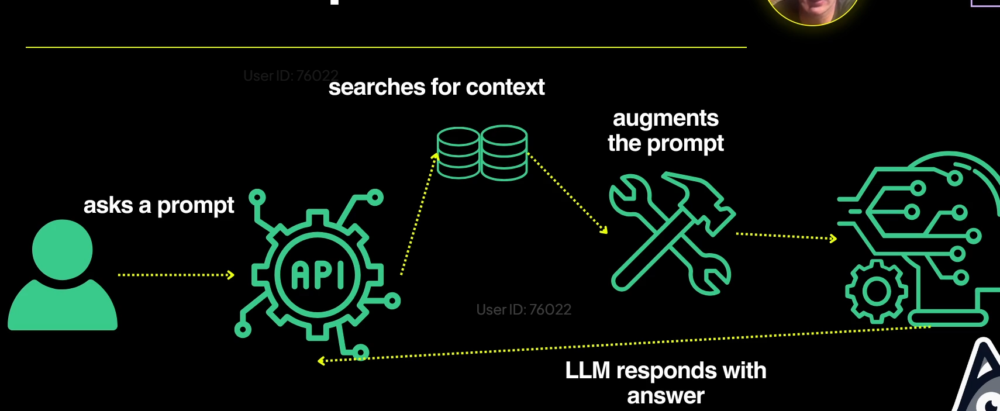
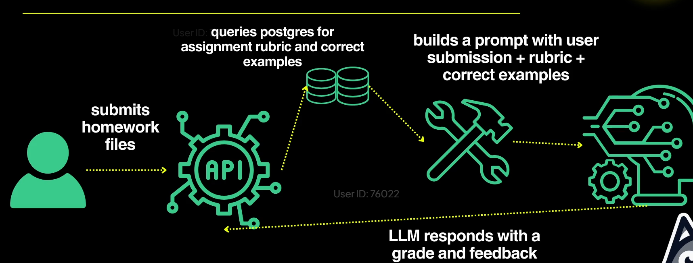
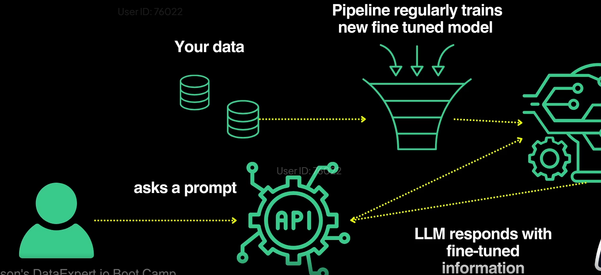
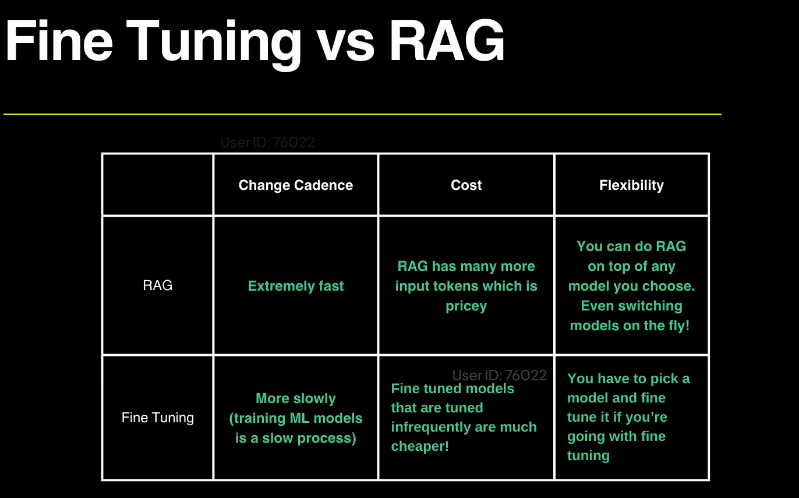

# what is LLM

# What is RAG and Why Should Data Engineers Care?

RAG allows you to supplement LLMs with your company data!  
Ask who is Q4 revenue, LLM doesnt know, RAG needs to build a context that is injected into a prompt, RAG take qeury find similar vector add it to prompt with question and generate response
context can be build in different ways, LLM doesnt have freedom to do what it wants.
GPT-4 is trained with public information.  
Both together will give powerful decisions.

# How RAG Works

RAG needs to build a context that is injected into a prompt.  
This context can be built in a few different ways!

- Less likely to hallucinate  
- That's why RAG is important  
- A user asks a prompt → it searches for context → augments the prompt (Retrieval Augmented Generation)  
- How RAG is set up:  
  

# Retrieval Step: Generating Context

Context is generated in 3 main ways (most common is through a vector database):

- **Vector Database**: Pinecone, Postgres (open source)
- **Keyword Search**: Light query matching
- **Graph Search**: Uses a graph database, takes a prompt → finds nouns → identifies the most important words

# Generation Step: Building the Prompt

- Define how we include keywords in the prompt  
- Augment the prompt with retrieved context  
- Decide how many tokens the prompt can include

# RAG is Easy to Set Up — But Hard to Get Right

# Example

# Alternative: Fine Tuning

We can also do fine tuning:  

- Build your model with your own data  and then train the model to learn from your data. no  augmentation steps, faster response.
- Train your model using both your data and internet data  
- Set up a cron job to regularly pull your data and retrain the model  
- This creates a new fine-tuned model

In this case, there is no need for the augmentation step — the model already contains the context.  
Basically, now we just submit the prompt.  

RAG (Retrieval-Augmented Generation):
✅ Rapid Context Updates: New context can be incorporated instantly as it becomes available — no retraining needed.

🔁 Model Flexibility: You can switch between different models on the fly. RAG works as a layer on top of any base model.

💸 Higher Cost: RAG is generally more expensive since it processes more input tokens per query, which increases cost.

Fine Tuning:
🐢 Slower Adaptation: Updating a model with new context requires re-training, which is time-consuming and resource-intensive.

📉 Lower Ongoing Cost: Once trained, fine-tuned models are cheaper to run because they don’t rely on retrieving external information for every query.

🧱 Model Lock-In: You need to choose and fine-tune a specific model. Changing models later requires redoing the fine-tuning process.

text-embedding-3-small

1- create an index in pincecone ( text embedding3-small) pick how many idmension our vector has.
use key 
pinecone_api_key = os.getenv('PINECONE_API_KEY') 
set pinecone_api_key=pcsk_387T4Z_KQRekcWNjaZPnk2A5QC3gQyZycrSryhzZ1VTQ3qyQZ61CiJpY58K1ursBXxivwT
2- text-embedding-3-small ( how the vector database matches)
rag-example-index dimension = 1536
3-  download requirement txt
4- run code server.py ( what is capital of poland)
5- create upsert_to_pinceone, create some matchs
6- change k = 1 insert each record alone add category
7- we will go to vedeo segment ( basic transcription) play without the upsert just print text
8 - text is a bit long to insert to dataabse
9- add score to filter down result, only have relevant 
what  was the mathematic olympiad winner in 2011
10- add chunk function, this will give us a bunch of chunk
11 - as a ML engineer you should know how much it should be these chunk model, overlap paraemter
12 - what happen if video is too big, if you try to get transcript from openAI
13- you need split video into multiple chunk ( 60 s) get full transcription upsert  insert each chunk to db alone and then insert to pincecone
14- https://www.gyan.dev/ffmpeg/builds/#release-builds
14- turn video into AI chatbot
15-  when you have so many vectors in the database it will not matter if you have k =5 or 20
